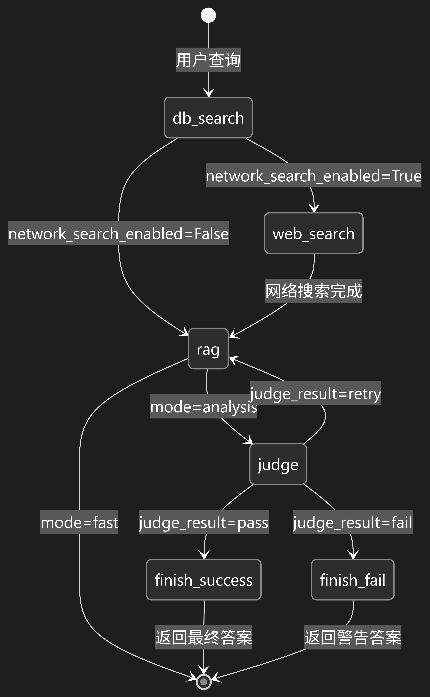
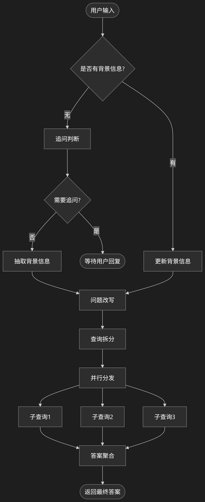
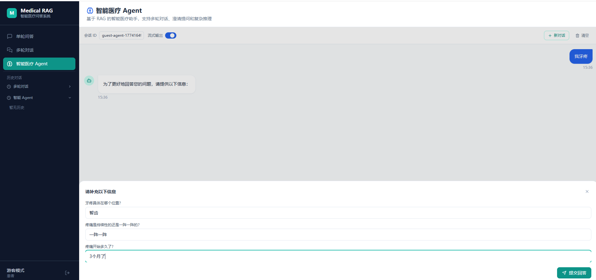
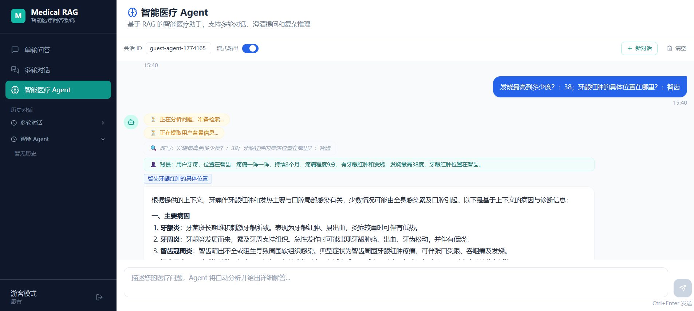

# Medical RAG - 医疗智能问答系统

基于 LangChain 0.3.27 + Milvus 2.6.x + LangSmith + langgraph 0.6.6 的专业医疗领域RAG(检索增强生成)系统，支持路由选择、多向量混合检索、智能检索、智能问答。

原项目来源 https://github.com/yolo-hyl/medical-rag?tab=readme-ov-file

## 🌟 项目亮点

- **专业医疗领域优化**：支持领域稀疏向量计算，可直接通过配置完成领域词表管理；也可以使用原生的Milvus进行稀疏向量管理
- **路由机制**：医疗RAG系统内置智能路由机制，能够根据用户查询的语义特征自动将请求路由到最相关的医疗子领域（如内科、外科、儿科等），从而提高检索的精准度和效率。路由机制基于预训练的领域分类模型，支持动态扩展新的医疗领域。
- **多向量混合检索**：稠密向量 + 稀疏向量(BM25) 的混合检索策略
- **灵活的架构设计**：支持一键配置多种LLM提供商（OpenAI、Ollama）和嵌入模型
- **完整的数据流水线**：从数据预处理、入库到检索问答、以及评估的端到端解决方案
- **SearxNG 智能检索**：系统集成了 SearxNG 元搜索引擎，当本地知识库无法满足查询需求时，智能体可以自动启用网络检索功能。SearxNG 提供了对多个搜索引擎的聚合结果，支持自定义引擎、语言和时间范围，确保检索结果的全面性和时效性。
- **RAG智能体**：自动确定检索内容、检索参数、自动确定是否符合文档事实、自动确定是否开启网络检索，将检索功能全部交由智能体托管，一站式定义查询即可得到你想要的答案！
- **更丰富的工程细节**：自带token估计、摘要提取、检索文档动态整合等重要特性，在多轮对话性能强悍。

## 🏗️ 项目主要架构

```
medical-rag/
├── run_api.py                # FastAPI 启动入口（默认 8005）
├── api_readme.md             # API 说明文档
├── frontend/                 # React + Vite 前端
├── src/MedicalRag/
│   ├── config/              # 配置管理系统
│   │   ├── models.py        # Pydantic配置模型
│   │   ├── loader.py        # 配置加载器
│   │   └── app_config.yaml  # 默认配置文件
│   ├── api/                 # FastAPI 服务
│   │   ├── app.py           # API 路由与启动初始化
│   │   └── auth.py          # 认证与会话存储
│   ├── core/                # 核心组件
│   │   ├── utils.py         # LLM/嵌入模型创建工具
│   │   ├── KnowledgeBase.py # 多向量知识库
│   │   ├── HybridRetriever.py # 混合检索器
│   │   ├── StagedHybridRetriever.py # 分阶段检索
│   │   ├── ColBERTReranker.py # ColBERT 重排器
│   │   ├── insert.py        # Milvus入库工具类
│   │   ├── DBFactory.py     # 知识库工厂，并行检索时保证单例客户端的线程安全
│   │   └── IngestionPipeline.py # 数据入库流水线
│   ├── embed/               # 嵌入相关
│   │   ├── vocab/           # 领域词表默认保存目录
│   │   ├── sparse.py        # BM25稀疏向量实现
│   │   └── bm25.py          # BM25适配器
│   ├── data/                # 数据处理
│   │   └── annotation.py    # 自动标注系统
│   ├── rag/                 # RAG核心
│   │   ├── RagBase.py       # RAG实现的基类
│   │   ├── RagEvaluate.py   # RAG评测的基类与实现类
│   │   ├── utils.py         # 工具类
│   │   ├── MultiDialogueRag.py   # 多轮对话实现类
│   │   └── SimpleRag.py     # 基础RAG实现
│   ├── prompts/             # 提示词管理
│   │   └── templates.py     # 提示词模板
│   └── agent/               # 智能体实现
│   │   ├── __init__.py
│   │   ├── models.py        # Agent 状态与输出模型
│   │   ├── tools/           # 工具包
│   │   │     ├── AgentTools.py   # 工具类
│   │   │     └── SearxSearch.py   # SearxNG 网络检索器
│   │   ├── utils.py  # 工具函数
│   │   ├── MedicalAgent.py  # 多轮问讯智能体
│   │   └── SearchGraph.py   # 单轮检索/问答子图
├── scripts/                 # 使用脚本
├── Milvus/                  # Milvus客户端启动相关
└── .vscode/                 # vscode快捷运行配置
```

## 🚀 快速开始

### 1. 环境准备

#### 数据集

[huatuo-qa](https://www.huatuogpt.cn/) 数据集 或 **[Huatuo-26M](https://github.com/FreedomIntelligence/Huatuo-26M)数据集**  详见 `data` 目录

#### 使用conda环境构建

```bash
git clone https://github.com/yolo-hyl/medical-rag
sudo apt install git-lfs  # 如果没有安装lfs 
git lfs pull  # 拉取大文件数据集
cd medical-rag
conda env create -f environment.yml  # 创建虚拟环境
```

#### 安装本项目

```bash
conda activate medrag
cd src
python -m pip install --no-build-isolation pkuseg  # 安装依赖包
pip install -e .
```

#### 启动基础服务

**启动 Milvus 向量数据库**

由于本项目默认可以采用稀疏向量管理，所以需要使用客户端Milvus。

```bash
# 使用项目提供的脚本
cd Milvus
bash standalone_embed.sh start
```

**启动 Ollama（如果使用本地模型）**

```bash
# 安装并启动 Ollama
ollama serve

# 拉取所需模型
ollama pull bge-m3:latest      # 嵌入模型
ollama pull qwen3:32b          # 对话模型
```

更多配置详见 [Ollama](https://ollama.com/)

**配置环境变量（建议）**

当前默认配置（`app_config.yaml`）中：

- `llm.provider=openai`
- `llm.model=deepseek-chat`
- `llm.env_key_name=DEEPSEEK_API_KEY`

所以至少需要配置：

```bash
# ~/.bashrc 或 .env
export DEEPSEEK_API_KEY="你的key"
```

可选环境变量：

```bash
# 后端监听地址（run_api.py 默认 0.0.0.0:8005）
export API_HOST="0.0.0.0"
export API_PORT="8005"

# 前端 Vite 代理目标（默认 http://localhost:8005）
export VITE_API_TARGET="http://127.0.0.1:8005"

# 如需 LangSmith 观测（可选）
export LANGCHAIN_API_KEY="你的langsmith_key"
export LANGCHAIN_TRACING_V2="true"
```

> 若你切回 Ollama（`llm.provider=ollama`），则可不配置 `DEEPSEEK_API_KEY`。

### 2. 配置及向量库说明

编辑 `src/MedicalRag/config/app_config.yaml`可修改默认配置，也可在引入config时动态修改部分配置：

```yaml
# Milvus向量数据库配置
milvus:
  uri: http://localhost:19530
  token: null
  collection_name: medical_knowledge
  drop_old: true  # 第一次建库时，是否删除同名 collection，调试用，生产环境严禁使用
  auto_id: false  # 可选是否自动生成id，否则采用hash值作为id自动去重

# 嵌入模型配置（支持多向量字段）
embedding:
  summary_dense:      # 问题/摘要 向量（稠密）
    provider: embedding  # 本地 embedding 模型（sentence-transformers）
    model: BAAI/bge-m3
    dimension: 1024  # 编码的向量维度
    preload: true  # 启动阶段预加载并缓存模型（减少首问冷启动）
    multi_gpu: true
    num_gpus: 4
    encode_batch_size: 512
  text_dense:         # 主文本向量（稠密）
    provider: embedding
    model: BAAI/bge-m3
    dimension: 1024
    preload: true
    multi_gpu: true
    num_gpus: 4
    encode_batch_size: 512
  text_sparse:        # BM25稀疏向量
    provider: self    # 或 "Milvus" 使用内置BM25
    vocab_path_or_name: vocab.pkl.gz
    algorithm: BM25
    domain_model: medicine  # 医疗领域分词
    k1: 1.5
    b: 0.75

# 大语言模型配置，与嵌入模型配置类似，对于请求模型有相同的字段
llm:
  provider: openai
  model: deepseek-chat
  env_key_name: DEEPSEEK_API_KEY
  base_url: https://api.deepseek.com/v1
  temperature: 0.1

# 数据字段映射
data:
  summary_field: question    # 问题字段
  document_field: answer     # 答案字段
  default_source: qa
  default_source_name: huatuo_qa

# 多轮对话配置
multi_dialogue_rag: 
  estimate_token_fun: avg  # 默认token估计方式
  llm_max_token: 1024  # 大模型最长token数量
  cut_dialogue_scale: 2   # 预估达到最长token时的裁切比例，2表时裁切一半的历史对话生成摘要
  max_token_threshold: 1.01   # 最长token的缓冲值 > 1 表示宽松策略，<1 表示严格策略
  smith_debug: false  # 是否使用 Langsmith 进行debug查看
  console_debug: true  # 是否启用控制台日志查看
  thinking_in_context: false  # 是否将思考内容加入上下文历史对话

agent:  # 智能体会沿用上述多轮对话rag的配置
  mode: analysis
  max_attempts: 2  # 每一个子目标查询的最大重试次数，否则进行联网搜索
  max_ask_num: 2  # 主动追问最大轮次
  console_debug: true  # Agent链路调试日志
  network_search_enabled: True  # 是否启用联网搜索
  network_search_cnt: 10  # 开启联网搜索时，返回的数量
  auto_search_param: True  # 是否开启确定搜索参数
  search_workflow_version: v2  # 联网搜索工作流版本（v1/v2）
  enable_condense_question: true
  web_search_provider: searxng
  searx_host: http://127.0.0.1:8081
  searx_language: zh-CN
  searx_engines: [wiki]
  searx_categories: null
  searx_time_range: null
  searx_safe_search: 1
  searx_v2_min_results: 20
  searx_v2_max_results: 30
  searx_v2_select_top_k: 6
  searx_v2_fetch_timeout_sec: 5.0
  searx_v2_max_content_chars: 3000

staged_retrieval:
  enabled: true
  colbert:
    enabled: true
    model_name: bert-base-uncased
    preload: true  # 启动阶段预加载并复用ColBERT模型
    max_length: 512
    top_k: 5
    batch_size: 16
    device: auto
```

### 3. 快速使用

#### 1. 构建BM25词表（自管理模式）

当配置 `embedding.text_sparse.provider: "self"` 时需要先构建词表：

```bash
conda activate medrag
python scripts/01_build_vocab.py
```

领域分词依赖 [pkuseg](https://github.com/lancopku/pkuseg-python) 库，更多领域可详见其项目主页。

#### 2. 数据入库

数据配置

```yaml
data:
  summary_field: question
  document_field: answer
  default_source: qa
  default_source_name: huatuo_qa
  default_lt_doc_id: ''
  default_chunk_id: -1
```

支持医疗QA数据的批量入库，自动处理多向量字段：

```bash
conda activate medrag
python scripts/02_ingest_data.py
```

**数据格式示例：**

```json
{
  "question": "高血压的症状有哪些？",
  "answer": "高血压的主要症状包括头痛、头晕、心悸..."
}
```

source和source_name可不指定，但需要配置默认的数据源和数据源名称。

入库后，Milvus中存储的字段如下：

| 字段名        | 字段类型            | 说明                                                               |
| ------------- | ------------------- | ------------------------------------------------------------------ |
| pk            | INT64 or VARCHAR    | 主键。当自动生成id时，使用INT64，否则使用varchar                   |
| text          | VARCHAR             | 核心知识文本。qa数据=summary+document；文献数据=document           |
| summary       | VARCHAR             | 当前知识摘要。qa数据=question；文献数据=采样或者生成的摘要示例文本 |
| document      | VARCHAR             | 原始文本。qa数据=answer；文献数据=原始文本                         |
| source        | VARCHAR             | 数据源。暂只支持：qa和literature                                   |
| source_name   | VARCHAR             | 数据源名称。例如：huatuo、neikebook                                |
| lt_doc_id     | VARCHAR             | 文档id。用于寻找同一个切片的文档                                   |
| chunk_id      | INT64               | 切片id。同一个切片的数据切片id相同，用于反查相关文档               |
| summary_dense | FLOAT_VECTOR        | 摘要的稠密向量                                                     |
| text_dense    | FLOAT_VECTOR        | 知识的稠密向量                                                     |
| text_sparse   | SPARSE_FLOAT_VECTOR | 知识的稀疏向量，用于关键词匹配                                     |

#### 3. 混合检索

测试多向量混合检索效果：

```bash
python scripts/03_search_data.py  
```

#### 4. RAG问答系统

基于检索结果生成专业医疗回答：

```bash
python scripts/04_basic_rag.py
```

将会生成以下数据的知识库检索回答：**我有点肚子痛，该怎么办？**

#### 5. 采样数据生成评测数据

从插入的示例数据中，采样200条回答，改写Q-A对，以便进行RAG评测：

```bash
cd data/eval
python change_data.py
```

#### 6. 评测RAG

使用改写后的Q-A对，进行RAG的评测，也可以使用自己的数据集，指定对应的列名即可

```bash
python 05_eval_rag.py
```

#### 7. 检索智能体

使用这个示例时，需要有一个能力较强的大模型，充当智能体调用工具的角色，所以需要修改这个脚本，传入 `ChatModel`

推荐使用 `qwen-plus` 在这个智能体中：检索参数、检索内容、是否符合文档事实、是否需要进行网络检索 全部由智能体自己确定，用户只需要定义想要问讯的问题即可回答。

注意，这里的网络检索默认使用本地部署的 SearxNG，你需要确保 `searx_host` 可访问（例如 `http://127.0.0.1:8081`）。

SearxNG使用参考文档：[SearXNG私有化部署与Dify集成](https://www.cnblogs.com/xiao987334176/p/18806251 "发布于 2025-04-02 16:55")



```bash
python 07_single_dialogue_agent.py
```

#### 9. 问答智能体

问答智能体依赖单轮RAG问答智能体，检索时使用的是其子图。推荐传入更强大的模型作为调度器。



```bash
python 08_medical_agent.py
```

#### 10. 启动 API 与前端（当前默认）

```bash
# 后端（默认 8005）
python run_api.py

# 前端
cd frontend
npm run dev
```

- 前端开发代理默认转发到`http://localhost:8005`

**使用截图**





## 🚨 注意事项

### 免责声明

⚠️ **重要提醒**: 本系统仅供学习研究使用，不能替代专业医疗建议。任何医疗决策都应咨询专业医生。

### 数据安全

- 确保医疗数据符合相关法规（HIPAA、GDPR等）
- 建议在私有环境部署
- 定期备份向量数据库

### 性能调优建议

1. **硬件配置**: 推荐16GB内存
2. **批处理**: 大量数据入库时使用批处理模式
3. **索引优化**: 根据数据量调整HNSW参数
4. **缓存策略**: 高频查询可增加缓存层

## 📝 许可证

本项目采用 MIT 许可证。详见 [LICENSE](LICENSE) 文件。

**如有问题，欢迎提交Issue或联系项目维护者！**
